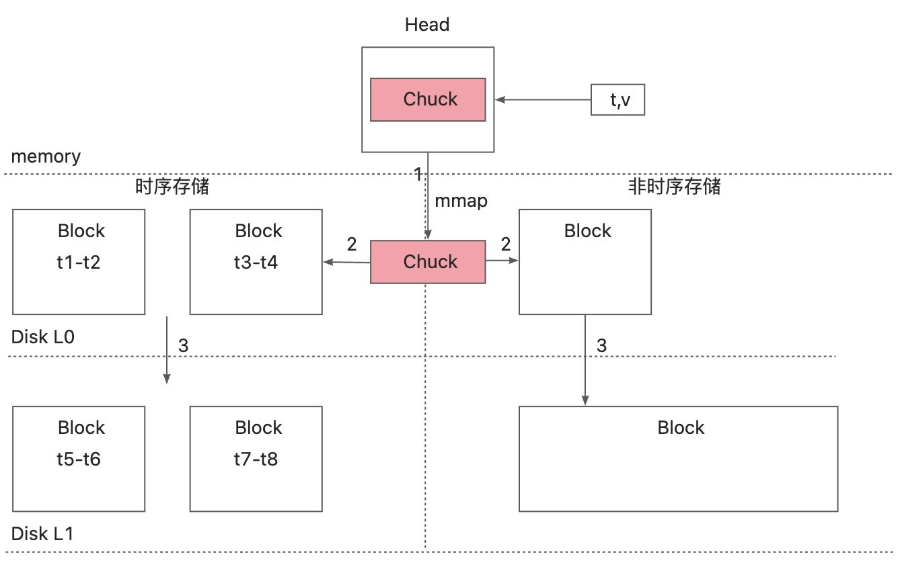

# 背景
prometheus提供了promql这个强大而易于学习的工具，使得基于时序数据的查询变得简单，但是很多时候也带来了很多困扰。比如下面这个例子

```arkts
iops_ecs / iops_ecs_threshold > 90
```

上面这个promql里面，iops_ecs代表某台ecs实时iops时序指标，prometheus会实时采集对应指标的值；iops_ecs_threshold代表对应ecs的iops阈值，所以iops_ecs / iops_ecs_threshold可以理解为iops的使用率，如果这个使用率大于90，则进行告警。


一般来说iops_ecs_threshold跟iops_ecs一样的抓取，但是iops_ecs_threshold这个阈值一般很少变化，如果每次都进行抓取的话，会造成严重网络和存储上的浪费。如果是push数据的模式，则可以进行一个优化，比如每一个小时上传一次数据，通过last_over_time函数进行处理，那么promql则变成了

```arkts
iops_ecs / last_over_time(iops_ecs_threshold[1h]) > 90
```

数据量和网络带宽浪费的问题解决了，但是客户端仍然需要定时传输时序数据，一旦这个过程中出现了一次中断，就会造成一个小时的查询异常。


如果采取下面这种极端的例子的情况呢，只上传一次数据，然后100年都不用重新上传。

```arkts
iops_ecs / last_over_time(iops_ecs_threshold[36000d]) > 90
```

不过prometheus的默认最长存储时间只有15d，而且即便prometheus能够存储那么久的数据，promethesu内部按照每两个小时实例话一个Block，即使理论可行，这个查询效率也是及其低效的。


其实我们想要的效果是类似于下面的效果

```arkts
iops_ecs / last_over_time(iops_ecs_threshold) > 90
```

即没有指定时间范围的last_over_time函数，不过对于默认的prometheus存储来说还是有一定挑战的，要允许一部分低频指标通过**非时间范围**分区的方式来进行组织，这样一来就需要对默认的存储引擎做一定的调整。


# 设计
## 指标配置
指标配置的首要目的就是区分出哪些是「普通指标」，哪些是「非易变指标」


在配置文件中prometheus.yml中加入对应的内容

```yaml
metric_config:
  - name: iops_ecs_threshold
    type: stable
    undo_rentetion : 100 #最多保留100个值
```

## 存储引擎


这里将存储分为原先的「时序存储」和将来要构建的「非时序存储」。


时序存储完全沿用之前的逻辑，基本分为三层compaction

1. 当head内存中的chuck数据达成<font style="color:rgb(28, 30, 33);background-color:rgb(246, 247, 248);">chunkRange*3/2的时候就会触发compaction，调用mmap函数落盘；</font>
2. <font style="color:rgb(28, 30, 33);background-color:rgb(246, 247, 248);">当磁盘的Chuck达到两个小时的时间跨度的时候，会compact形成一个block，每个block都有自己专属的时间范围；</font>
3. <font style="color:rgb(28, 30, 33);background-color:rgb(246, 247, 248);">当block数据多到一定程度的时候，会继续进行compaction，同时会处理数据乱序问题和block的时间范围重叠问题。</font>

<font style="color:rgb(28, 30, 33);background-color:rgb(246, 247, 248);"></font>

<font style="color:rgb(28, 30, 33);background-color:rgb(246, 247, 248);">右边的非时序存储是本次新加入的，第一步mmap的compaction仍然沿用原先prometheus的步骤，但是第二步compaction的时候，首先判断是否是「非易变指标」，如果是则进行右边非时序存储后面的两步compaction</font>

2. 每次新加入的数据跟原先的Block做全量合并，然后生成一个新的Block，保证L0层的Block只有一个，由于每次都做全量合并，要求L0层的Block的大小不能太大。当L0层的block大到某个阈值的时候，则向下进行第三步的合并；
3. 将L0层的block和L1层的block进行合并，这个时候将会根据指标配置的undo_rentetion参数进行数据汰换，比如合并之后某个指标有150个数据点（sample），这个指标点的undo_retention设置为100，那么合并之后只会保留最近的100个数据点。


通过上面的设计可以看出，非时序存储的Block只有两个，任何时间点的指标查询只会去查询两个block，这个io开销是很小的。同时block的结构仍然保持跟原有的prometheus一致，这样改动也是非常的低。


同时这里「非易变指标」本身就是变动较小的指标，即便储存最近的100个数据，存储的时间跨度也是非常的大，这样在存储成本和查询效率等各个方面都是大大的飞跃。

